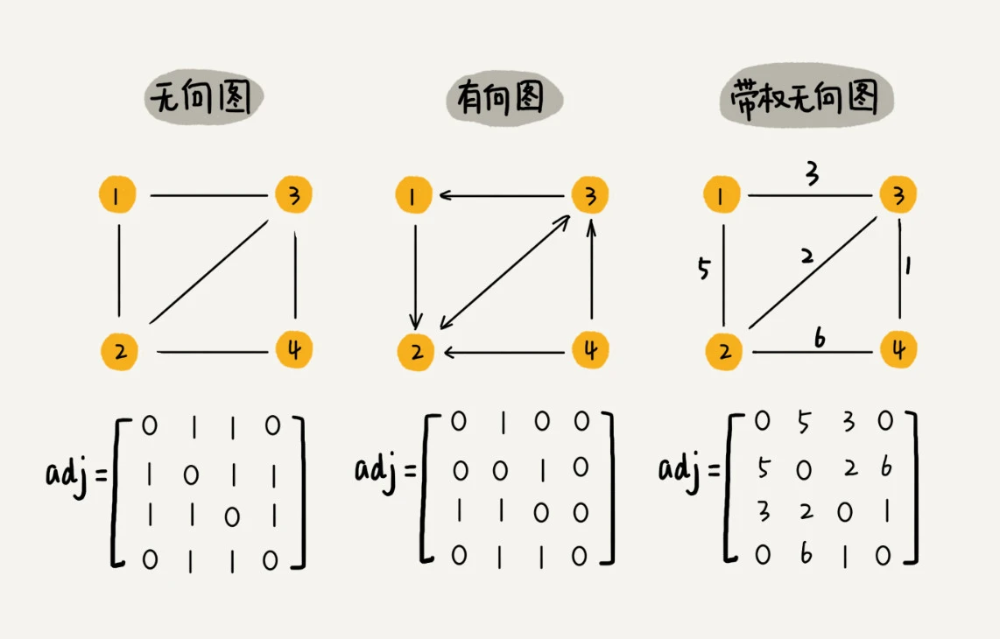
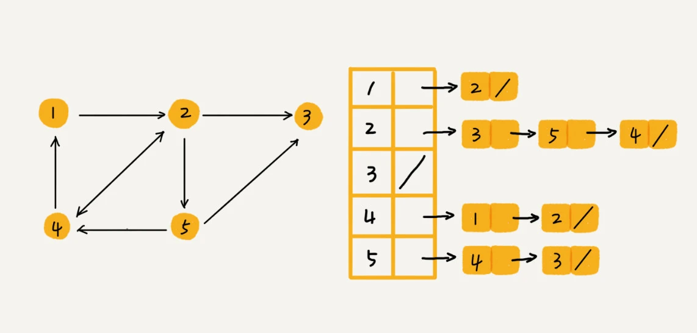

### 一，图的理解

**图和树一样都是非线性表数据结构**，但是更复杂，涉及图的算法有很多，也非常复杂，比如图的搜索、最短路径、最小生成树、二分图等等。树中的元素我们称为节点，图中的元素我们叫作**顶点**（`vertex`）。图中的一个顶点可以与任意其他顶点建立连接关系，这种连接关系叫作**边**（`edge`）。有方向的图叫做“有向图”。以此类推，我们把边没有方向的图就叫做“无向图”。

在有向图中，我们把度分为**入度**（In-degree）和**出度**（Out-degree）。顶点的入度，表示有多少条边指向这个顶点；顶点的出度，表示有多少条边是以这个顶点为起点指向其他顶点。通过方向可以用来表示微博的粉丝量和关注量，入度表示有多少粉丝，出度表示关注了多少人。

每条边都有一个权重（`weight`）的无向图叫作**带权无向图**（`weighted graph`），通过这个权重可以用来表示QQ好友间的亲密度。

### 二，邻接矩阵存储方法

图最直观的一种存储方法就是，**邻接矩阵**（`Adjacency Matrix`）。

邻接矩阵的底层依赖一个二维数组。对于无向图来说，如果顶点 `i` 与顶点 `j` 之间有边，我们就将 `A[i][j]` 和 `A[j][i]` 标记为 `1`；对于有向图来说，如果顶点 `i` 到顶点 `j` 之间，有一条箭头从顶点 `i` 指向顶点 `j` 的边，那我们就将 `A[i][j]` 标记为 `1`。同理，如果有一条箭头从顶点 `j` 指向顶点 `i` 的边，我们就将 `A[j][i]` 标记为 `1`。对于带权图，数组中就存储相应的权重。


> 打印出可视化邻接矩阵后，只需看对角线上或者下部分即可画出节点连接关系图。

c++ 实现的无向图代码如下所示：

```cpp
#include <iostream>
#include <vector>

using namespace std;

class GraphAdjMatrix {
private:
    vector<vector<int>> adjMatrix; // 邻接矩阵

public:
    GraphAdjMatrix(int numNodes) {
        adjMatrix.resize(numNodes, vector<int>(numNodes, 0)); // 初始化矩阵
    }

    // 添加边（无向图）
    void addEdge(int i, int j, int weight = 1) {
        adjMatrix[i][j] = weight;
        adjMatrix[j][i] = weight; // 如果是有向图则去掉这一行
    }

    // 打印邻接矩阵
    void printMatrix() {
        for (const auto& row : adjMatrix) {
            for (int val : row) {
                cout << val << " ";
            }
            cout << endl;
        }
    }
};

int main() {
    GraphAdjMatrix graph(4); // 创建一个有 5 个节点的图

    graph.addEdge(1, 0);
    graph.addEdge(2, 0);
    graph.addEdge(2, 1);
    graph.addEdge(3, 1);
    graph.addEdge(3, 2);

    graph.printMatrix(); // 打印邻接矩阵

    return 0;
}

```

程序运行后输出结果如下所示：

```bash
0 1 1 0 
1 0 1 1 
1 1 0 1 
0 1 1 0 
```

邻接矩阵存储图虽然存储方式简单、也方便计算，但是在一些情况下会造成空间的浪费。

如果用邻接矩阵存储无向图会造成存储空间的浪费，因为对于无向图来说，如果 `A[i][j]` 等于 1，那 `A[j][i]` 也肯定等于 1。实际上，我们只需要存储一个就可以了。也就是说，无向图的二维数组中，**如果我们将其用对角线划分为上下两部分，那我们只需要利用上面或者下面这样一半的空间就足够了，另外一半白白浪费掉了**。

还有，如果我们存储的是稀疏图（`Sparse Matrix`），也就是说，顶点很多，但每个顶点的边并不多，那邻接矩阵的存储方法就更加浪费空间了。
> 如果有 `n` 个顶点，所需构建的二维矩阵就是 `n*n`，如果每个顶点的边不是很多，就是造成矩阵的很多元素都是 `0`，从而导致存储空间的浪费。

### 三，邻接表存储方法

针对上面邻接矩阵比较浪费内存空间的问题，我们来看另外一种图的存储方法，邻接表（`Adjacency List`）。

邻接表的存储关系如下图所示。



图中画的是一个有向图的邻接表存储方式，**每个顶点对应的链表里面，存储的是指向的顶点**。其 `c++` 实现代码如下所示：

```cpp
#include <iostream>
#include <vector>
#include <list>

using namespace std;

class GraphAdjList {
private:
    vector<list<int>> adjList; // 邻接表

public:
    GraphAdjList(int numNodes) {
        adjList.resize(numNodes); // 初始化邻接表
    }

    // 添加边（有向图）,i/j 是节点序号
    void addEdge(int i, int j) {
        adjList[i-1].push_back(j-1);
        // adjList[j].push_back(i); // 如果是有向图则去掉这一行
    }

    // 打印邻接表
    void printList() {
        for (int i = 0; i < adjList.size(); i++) {
            cout << "Node " << i+！ << ":";
            for (int neighbor : adjList[i]) {
                cout << " " << neighbor+1;
            }
            cout << endl;
        }
    }
};

int main() {
    GraphAdjList graph(5); // 创建一个有 5 个节点的图

    graph.addEdge(1, 2);
    graph.addEdge(2, 3);
    graph.addEdge(2, 5);
    graph.addEdge(2, 4);
    graph.addEdge(4, 1);
    graph.addEdge(4, 2);
    graph.addEdge(5, 4);
    graph.addEdge(5, 3);

    graph.printList(); // 打印邻接表

    return 0;
}
```

程序运行后输出结果如下所示:

```bash
Node 1: 2
Node 2: 3 5 4
Node 3:
Node 4: 1 2
Node 5: 4 3
```

邻接表的本质是用时间换空间，邻接矩阵存储起来比较浪费空间，但是使用起来比较节省时间。相反，邻接表存储起来比较节省空间，但是使用起来就比较耗时间。

就像图中的例子，如果我们要确定，是否存在一条从顶点 `2` 到顶点 `4` 的边，那我们就要遍历顶点 `2` 对应的那条链表，看链表中是否存在顶点 `4`。而且，**链表的存储方式对缓存不友好**。所以，比起邻接矩阵的存储方式，在邻接表中查询两个顶点之间的关系就没那么高效了。

邻接表结构长得像散列表，因此也可对邻接表进行改进升级。我们可以将邻接表中的链表改成平衡二叉查找树。实际开发中，我们可以选择用红黑树。这样，我们就可以更加快速地查找两个顶点之间是否存在边了。当然，这里的二叉查找树可以换成其他动态数据结构，比如跳表、散列表等。除此之外，我们还可以将链表改成有序动态数组，可以通过二分查找的方法来快速定位两个顶点之间否是存在边。

### 邻接矩阵与邻接表的对比

1，邻接矩阵：
- 优点：访问任意两节点之间是否有边的操作非常快，时间复杂度为 O(1)。
- 缺点：占用空间较大，尤其是对于稀疏图（即边数远小于节点数平方）的情况。

2，邻接表：
- 优点：**占用空间少**，适合稀疏图。
- 缺点：查找任意两节点之间是否有边的操作较慢，时间复杂度为 O(V)，其中 V 是与该节点相连的节点数量。但是针对这个问题，邻接表还有改进升级版，即将链表换成更加高效的动态数据结构，比如平衡二叉查找树、跳表、散列表等。
