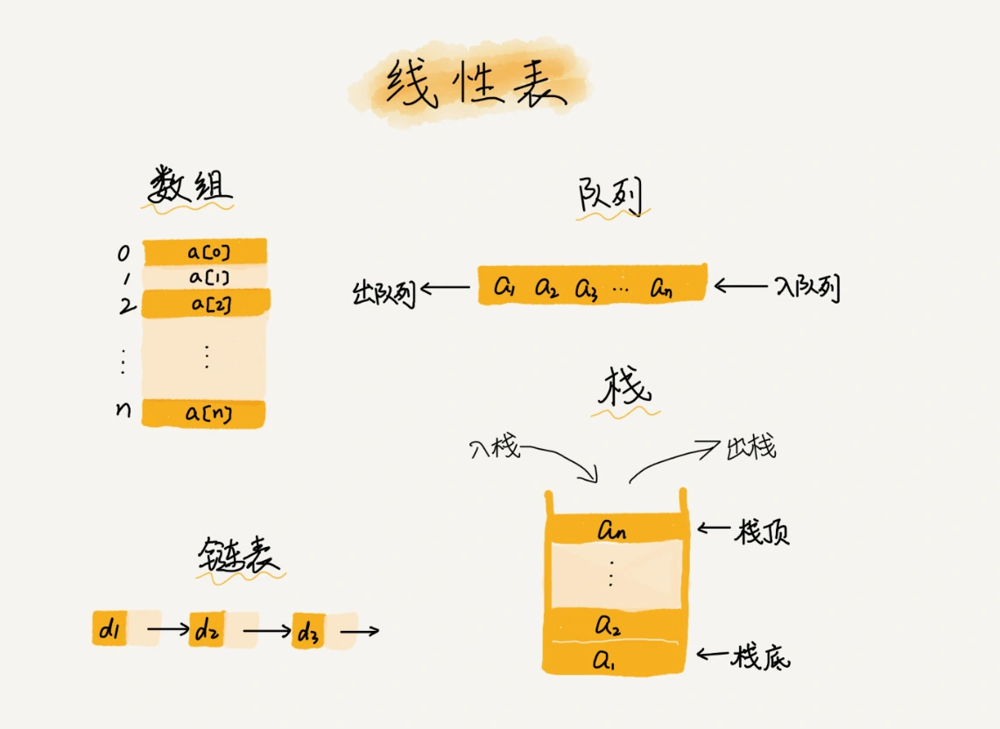

### 一，数组定义及特点

数组（Array）是一种线性表数据结构。它的本质是用**一组连续**的内存空间，来存储一组具有**相同类型**的数据。数组的两个关键词是：

+ **线性表**
+ **连续**的内存空间和**相同类型**的数据（**随机访问**）

#### 1.1，线性表

顾名思义，线性表就是数据排成像一条线一样的结构，线性表上的每个元素都有一个唯一的前驱和后继元素，第一个和最后一个元素除外。**除了数组，链表、队列、栈等也是线性表结构**。



线性表的基本操作（增删改查）包括但不限于：

1. **初始化**：创建一个空的线性表。
2. **插入**：在指定位置插入一个元素。
3. **删除**：删除指定位置的元素。
4. **更新**（赋值）：更新指定位置的元素。
5. **查找**：查找指定元素在表中的位置。

和线性表对立的数据结构是非线性表，如二叉树、堆、图等。之所以叫非线性，是因为，在非线性表中，数据之间并不是简单的前后关系。


#### 1.2，连续的内存空间和相同类型的数据

数组结构定义的**两个限制**：线性表和连续的内存空间和相同类型的数据，似的其有一个杀手锏级别的特性：“支持随机访问”。当计算机需要随机访问数组中的某个元素时，通过下面的寻址公式计算出该元素存储的内存地址，然后计算机通过地址就可访问内存中的数据了。

```cpp
a[i]_address = base_address + i * data_type_size // 数组从 0 开始计数
a[k]_address = base_address + (k-1)*type_size // 如果数组从 1 开始计数
```

从上述**寻址公式**可以看出，如果数组从 `1` 开始编号，根据寻址公式，每次随机访问数组元素都多了一次减法运算，对于 CPU 来说，就是多了一次减法指令。因此，**在大部分编程语言中，数组都是从 0 开始编号的，这样可减少指令次数**。

值得注意的是，数组是适合查找操作，但查找操作的时间复杂度并不为 $O(1)$，只有**根据下标**随机访问的时间复杂度为 $O(1)$；即便是排好序的数组，用二分查找，时间复杂度也是 $O(logn)$。

### 二，低效的“插入”和“删除”

数组结构的两个限制使得数组的删除、插入操作变得非常低效，因为为了保证数组的连续性，需要做大量的数据搬移工作。

假设数组的长度为 $n$，现在，如果我们需要将一个数据插入到数组中的第 $k$ 个位置。为了把第 $k$ 个位置腾出来，给新来的数据，我们需要将第 $k～n$ 这部分的元素都顺序地往后挪一位。

分两种情况，如果是数组末尾插入数据，则不需要搬移数据，因此最好时间复杂度为 $O(1)$；如果在数组的开头插入元素，那所有的数据都需要依次往后移动一位，所以最坏时间复杂度是 $O(n)$。因为我们在每个位置插入元素的概率是一样的，所以**平均情况时间复杂度**为 $(1+2+...n)/n=O(n)$。

### 三，容器能否完全替代数组？

`C++`、`JAVA` 等语言都提供了类似数组的容器类，比如 `C++` `STL` 中的 `vector`。一般情况下，推荐用容器开发，简单省事、代码易懂，底层和高性能开发用数组，毕竟容器的灵活性还是牺牲了一定性能的。

### 参考资料

《数据结构与算法之美》

