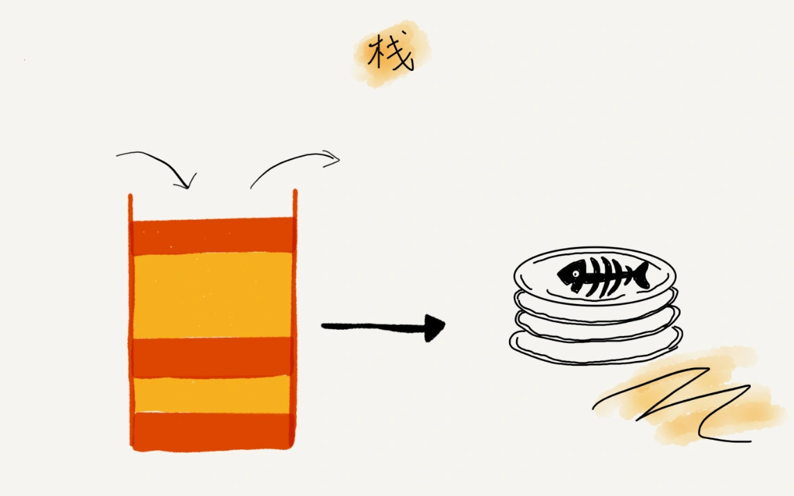

## 一，栈的原理

栈和队列都是为了完成特定软件功能而设计出来的虚拟逻辑结构，这和数组、链表是物理结构不一样，它们的实现可以基于数组和链表。

栈的直观理解的话可以想象成“叠盘子”，放的时候都是从下往上一个一个放；取的时候，我们也是从上往下一个一个地依次取，不能从中间任意抽出。



抽象出来栈的定义（特性）就是**后进者先出，先进者后出**，且只允许在一端插入和删除数据的数据结构；在项目中如果某个数据集合满足这种特性，则应当首选"栈"这种数据结构。
> 栈和队列都是一种"操作受限"的线性表（逻辑结构），只允许在一端插入和删除数据；**栈的特性是先进后出，队列是先进先出**。

### 二，栈的实现

实现栈之前，首先我们得知道栈主要包含两种操作：**入栈和出栈**。栈既可以用数组来实现，也可以用链表来实现。用数组实现的栈，我们叫作顺序栈，用链表实现的栈，我们叫作链式栈。

基于数组实现的栈的 `C++` 代码如下：

```cpp
#include <iostream>
#define MAX_SIZE 100

class Stack {
private:
    int arr[MAX_SIZE];
    int top;

public:
    Stack() : top(-1) {}

    void push(int x) {
        if (is_full()) {
            std::cout << "Stack overflow\n";
            return;
        }
        arr[++top] = x;
    }

    void pop() {
        if (is_empty()) {
            std::cout << "Stack underflow\n";
            return;
        }
        --top;
    }

    int get_top() {
        if (is_empty()) {
            std::cout << "Stack is empty\n";
            return -1; // 这里返回-1表示栈为空
        }
        return arr[top];
    }

    bool is_empty() {
        return top == -1;
    }

    bool is_full() {
        return top == MAX_SIZE - 1;
    }
};

int main() {
    Stack stack;
    stack.push(10);
    stack.push(20);
    stack.push(30);
    std::cout << "Top element is " << stack.get_top() << std::endl;
    stack.pop();
    std::cout << "Top element is " << stack.get_top() << std::endl;
    stack.pop();
    stack.pop();
    stack.pop(); // This will cause underflow

    return 0;
}
```

### 三，栈的应用

**1，栈在函数调用中的应用**

**操作系统给每个线程分配了一块独立的内存空间，这块内存被组织成“栈”这种结构, 用来存储函数调用时的临时变量**。每进入一个函数，就会将临时变量作为一个栈帧入栈，当被调用函数执行完成，返回之后，将这个函数对应的栈帧出栈。

**2，栈在表达式求值中的应用**

**编译器通过两个栈来实现表达式求值**。其中一个保存操作数的栈，另一个是保存运算符的栈。我们从左向右遍历表达式，当遇到数字，我们就直接压入操作数栈；当遇到运算符，就与运算符栈的栈顶元素进行比较。

如果比运算符栈顶元素的优先级高，就将当前运算符压入栈；如果比运算符栈顶元素的优先级低或者相同，从运算符栈中取栈顶运算符，从操作数栈的栈顶取 2 个操作数，然后进行计算，再把计算完的结果压入操作数栈，继续比较。

**3，栈在括号匹配中的应用**

除了用栈来实现表达式求值，我们还可以借助栈来检查表达式中的括号是否匹配。

用栈来保存未匹配的左括号，从左到右依次扫描字符串。当扫描到左括号时，则将其压入栈中；当扫描到右括号时，从栈顶取出一个左括号。如果能够匹配，比如“(”跟“)”匹配，“[”跟“]”匹配，“{”跟“}”匹配，则继续扫描剩下的字符串。如果扫描的过程中，遇到不能配对的右括号，或者栈中没有数据，则说明为非法格式。当所有的括号都扫描完成之后，如果栈为空，则说明字符串为合法格式；否则，说明有未匹配的左括号，为非法格式。

**4，实现浏览器的前进后退操作**

使用两个栈来实现浏览器的前进和后退功能是一个常见的应用场景。这里的两个栈分别用于存储用户访问的历史记录和前进记录。其工作原理以及具体的实现方式如下所示：

**原理**：

- 栈1（`back_stack`）：用于存储用户访问过的页面，即浏览器的历史记录。当用户点击“后退”按钮时，当前页面会被弹出并推入另一个栈（forward_stack），同时显示前一个页面。
- 栈2（`forward_stack`）：用于存储用户后退操作后的页面。当用户点击“前进”按钮时，forward_stack 的页面会被弹出并推入 back_stack，显示该页面。

**工作流程**：

1. 访问新页面：
   - 将新页面推入 back_stack。
   - 清空 forward_stack，因为访问新页面后，前进记录失效。
2. 后退操作：
   - 如果 back_stack 不为空，将当前页面推入 forward_stack。
   - 将 back_stack 的栈顶页面弹出并设置为当前页面。
3. 前进操作：
   - 如果 forward_stack 不为空，将当前页面推入 back_stack。
   - 将 forward_stack 的栈顶页面弹出并设置为当前页面。
  
### 四，单调栈

单调栈模板题解法：[单调栈解题模板秒杀八道题](https://lucifer.ren/blog/2020/11/03/monotone-stack/)

### 参考资料

[08 | 栈：如何实现浏览器的前进和后退功能？](https://time.geekbang.org/column/article/41222)

