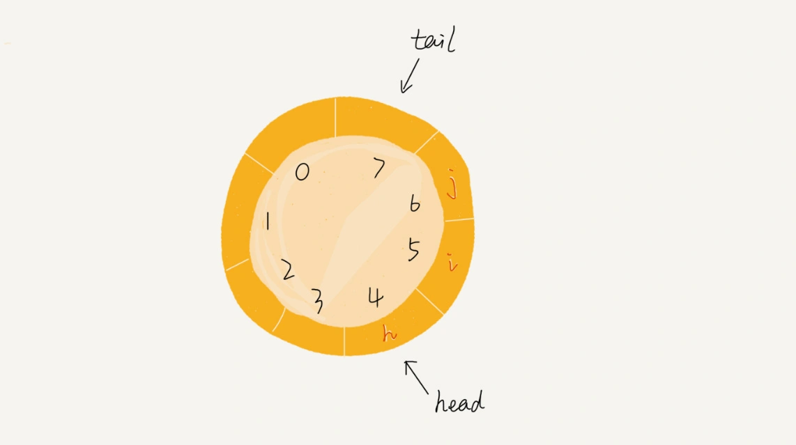

### 一，队列的原理

队列这个概念非常好理解。你可以把它想象成排队买票，先来的先买，后来的人只能站末尾，不允许插队。先进者先出，这就是典型的“队列”。

栈只支持两个基本操作：入栈 push()和出栈 pop()。队列和栈非常相似，支持的操作也很有限，最基本的操作也是两个：入队 enqueue()，放一个数据到队列尾部；出队 dequeue()，从队列头部取一个元素。


总结就是：队列跟栈一样，也是一种操作受限的线性表数据结构，只允许在一端插入和删除数据；**不同的是，栈的特性是先进后出，队列是先进先出**；栈的操作只在栈顶（入栈和出栈），队列的操作分别在队头（出队）和队尾（入队）。

队列的应用也非常广泛，特别是一些具有某些额外特性的队列，比如循环队列、阻塞队列、并发队列。

### 二，顺序队列和链式队列

队列和栈一样，也是一种抽象的数据结构，操作上具有“先进先出”的特性，队列只允许在"队首"进行删除操作，而在"队尾"进行插入操作。基于数组实现的顺序队列的`C++`代码如下：

```cpp
// 用数组实现的队列
class ArrayQueue(){
    // 数组：items，数组大小：n
private:
    int n = 20;
    int head = 0;   // 队头下标
    int tail = 0;   // 队尾下标

public:
    // 带参数的构造函数：申请一个大小为 capacity 的数组
    ArrayQueue(int capacity){
        // items = new int[capacity];
        vector<int> items(capacity);
        n = capacity;
    }
    // 入队
    bool enqueue(int item){
        if(tail == n) return False;
        items[tail] = item;
        ++tail;
        return True;
    }
    // 时间复杂度为O(1)的入队操作
    bool enqueue2(int item){
        // tail == n，表示队列末尾没有空间了
        if(tail == n){
            // tail == n && head == 0，表示整个队列都占满了
            if(head == 0) return False;
            // 数据搬移
            for(i=head; i<tail; ++i){
                items[i-head] = items[i];
            }
            // 重新更新 head 和 tail
            tail = tail - head; // tail -= head
            head = 0;   // 队首位置
        }
        items[tail] = item;
        ++tail;
        return True;
    }
    // 出队
    bool dequeue(){
        // head == tail 表示队列为空
        if (head == tail) return null;
        int ret = items[tail];
        ++head;
        return ret;
    }
}
```

入队时间复杂度为 `O(1)`。分析：大部分情况下入队操作时间复杂度为 `O(1)`，只有在 `tail` 在末尾时( `tail=n` )才进行数据迁移，此时的入队操作时间复杂度为 `O(n)`，根据均摊时间复杂度得到入队时间复杂度为 `O(1)`。


### 三，循环队列

循环队列，顾名思义，它长得像一个环。原本数组是有头有尾的，是一条直线。现在我们把首尾相连，变成了一个环，如下图所示：



前面用数组实现队列，当 `tail = n` 时，会有数据搬移操作，而循环队列首尾相连，避免了数据搬移操作。用数组实现循环队列的代码的关键在于**判断队列满和空的条件，以及队头队尾指针的更新**：

+ **非循环队列**:
    + 队满：`tail = n`
    + 队空：`head = tail`
+ **循环队列**：
    + 队满：`(tail + 1) % n = head`
    + 队空：`head = tail`
    + 队头指针更新: `head = (head + 1) % n`
    + 队尾指针更新: `tail = (tail + 1) % n`

基于数组实现的循环队列的`C++`代码如下：

```cpp
// 用数组实现的循环队列，关键在于创建队头和队尾下标
class CircularQueue(){
private:
    int n = 12;
    int items[];
    // head表示队头下标，tail表示队尾下标
    int head = 0;
    int tail = 0;
public:
    CircularQueue(int capacity){
        // items = new int[capacty];
        vector<int> items(capacity);
        n = capacity;
    }
    // 入队函数
    bool enqueue(int item){
        // 队列满了
        if((tail+1) % n = head) return False;
        items[tail] = item;
        tail = (tail + 1) % n
    }
    // 出队函数
    int dequeue(){
        // // 如果head == tail 表示队列为空
        if(head == tail) return null;
        int ret = items[head];
        head = (head + 1) % n;
        return ret;
    }
}
```

完整 `c++` 代码如下所示：

```cpp
#include <iostream>
#define MAX_SIZE 100

class Queue {
private:
    int arr[MAX_SIZE];
    int front;
    int rear;

public:
    Queue() : front(0), rear(0) {}

    void enqueue(int x) {
        if (isFull()) {
            std::cout << "Queue overflow\n";
            return;
        }
        arr[rear] = x;
        rear = (rear + 1) % MAX_SIZE;
    }

    void dequeue() {
        if (isEmpty()) {
            std::cout << "Queue underflow\n";
            return;
        }
        front = (front + 1) % MAX_SIZE;
    }

    int getFront() {
        if (isEmpty()) {
            std::cout << "Queue is empty\n";
            return -1; // 这里返回-1表示队列为空
        }
        return arr[front];
    }

    bool isEmpty() {
        return front == rear;
    }

    bool isFull() {
        return (rear + 1) % MAX_SIZE == front;
    }
};

int main() {
    Queue queue;
    queue.enqueue(10);
    queue.enqueue(20);
    queue.enqueue(30);
    std::cout << "Front element is " << queue.getFront() << std::endl;
    queue.dequeue();
    std::cout << "Front element is " << queue.getFront() << std::endl;
    queue.dequeue();
    queue.dequeue();
    queue.dequeue(); // This will cause underflow

    return 0;
}
```

### 四，阻塞队列和并发队列

1. 阻塞队列就是入队、出队操作都可以阻塞，简单来说就是队列为空时，队首取数据会被阻塞，队列为满时，队尾插入数据会被阻塞，直到队列有空闲数据才允许在队尾插入数据。**使用阻塞队列结构可以轻松实现“消费者-生产者模型”**。
2. 并发队列就是队列的操作多线程安全。最简单直接的实现方式是直接在 `enqueue()、dequeue()` 方法上加锁，但是锁粒度大并发度会比较低，同一时刻仅允许一个存或者取操作。实际上，基于数组的循环队列，利用 `CAS` 原子操作，可以实现非常高效的并发队列。这也是循环队列比链式队列应用更加广泛的原因。

### 参考资料

《数据结构与算法之美》-队列
