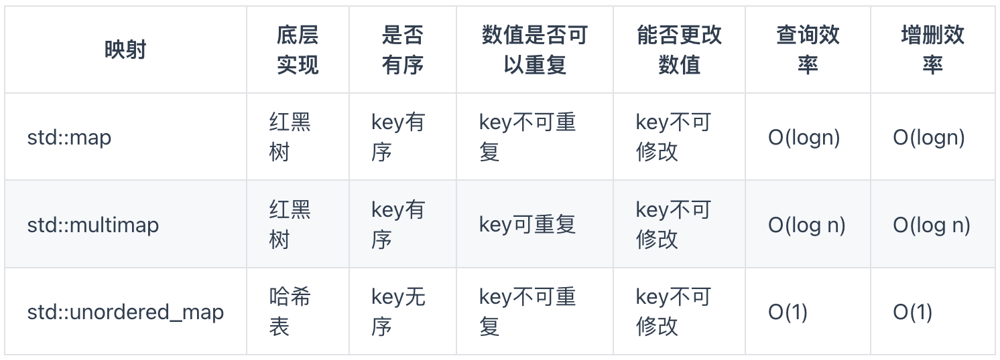

- [数组](#数组)
  - [数组理论基础](#数组理论基础)
  - [数组应用](#数组应用)
  - [二分查找](#二分查找)
    - [leetcode69. x 的平方根](#leetcode69-x-的平方根)
    - [leetcode367. 有效的完全平方数](#leetcode367-有效的完全平方数)
    - [leetcode35 搜索插入位置](#leetcode35-搜索插入位置)
    - [leetcode34. 在排序数组中查找元素的第一个和最后一个位置](#leetcode34-在排序数组中查找元素的第一个和最后一个位置)
    - [二分查找总结](#二分查找总结)
- [双指针法](#双指针法)
  - [双指针法应用](#双指针法应用)
    - [leetcode27 移除元素](#leetcode27-移除元素)
    - [leetcode344 反转字符串](#leetcode344-反转字符串)
    - [卡码网54. 替换数字（第八期模拟笔试）](#卡码网54-替换数字第八期模拟笔试)
    - [leetcode151.翻转字符串里的单词](#leetcode151翻转字符串里的单词)
    - [leetcode206 反转链表](#leetcode206-反转链表)
- [栈和队列](#栈和队列)
  - [栈和队列的原理](#栈和队列的原理)
  - [栈和队列的应用](#栈和队列的应用)
    - [leetcode232用栈实现队列](#leetcode232用栈实现队列)
    - [leetcode225用队列实现栈](#leetcode225用队列实现栈)
    - [leetcode20 有效的括号](#leetcode20-有效的括号)
    - [leetcode1047. 删除字符串中的所有相邻重复项](#leetcode1047-删除字符串中的所有相邻重复项)
    - [leetcode 239. 滑动窗口最大值](#leetcode-239-滑动窗口最大值)
- [哈希表](#哈希表)
  - [哈希表原理](#哈希表原理)
  - [哈希表应用](#哈希表应用)
    - [leetcode242.有效的字母异位词](#leetcode242有效的字母异位词)
- [回溯算法](#回溯算法)
  - [回溯算法原理](#回溯算法原理)
  - [回溯法模板](#回溯法模板)
  - [回溯算法应用](#回溯算法应用)
    - [77. 组合](#77-组合)
- [动态规划](#动态规划)
  - [动态规划解题步骤](#动态规划解题步骤)
  - [动态规划的应用](#动态规划的应用)
    - [leetcode509. 斐波那契数](#leetcode509-斐波那契数)
    - [leetcode70. 爬楼梯](#leetcode70-爬楼梯)
    - [leetcode746. 使用最小花费爬楼梯](#leetcode746-使用最小花费爬楼梯)
    - [leetcode62. 不同路径](#leetcode62-不同路径)
- [单调栈](#单调栈)
  - [单调栈原理](#单调栈原理)
  - [单调栈应用](#单调栈应用)
    - [leetcode739. 每日温度](#leetcode739-每日温度)
    - [leetcode496. 下一个更大元素 I](#leetcode496-下一个更大元素-i)
    - [leetcode503. 下一个更大元素 II](#leetcode503-下一个更大元素-ii)
    - [leetcode42. 接雨水](#leetcode42-接雨水)
    - [leetcode84. 柱状图中最大的矩形](#leetcode84-柱状图中最大的矩形)
- [参考资料](#参考资料)

## 数组

### 数组理论基础

数组是存放在连续内存空间上的相同类型数据的集合。数组可以方便的通过下标索引的方式获取到下标对应的数据，数组举例如下图所示:


**数组的两个特性**:
- 数组下标都是从 `0` 开始的。
- 数组内存空间的地址是连续的

**因为数组在内存空间的地址是连续的，所以我们在删除或者增添元素的时候，就难免要移动其他元素的地址**。

这也意味着**数组的元素是不能删的，只能覆盖**。

### 数组应用

### 二分查找

二分查找（`Binary Search`）算法是一种针对**有序且不含重复数据的顺序数据表**的查找算法，时间复杂度为 $O(logn)$ ，二分查找虽然性能比较优秀，但应用场景也比较有限。

二分法虽然原理理解简单，但是实际写代码的时候还是比较复杂，属于那种**一看就会，一写就废**的算法。主要原因就是对区间的定义没有理解清楚，在循环中没有始终坚持根据查找区间的定义来做边界处理。

a[mid]跟要查找的 value 的大小关系有三种情况：大于、小于、等于。对于 a[mid]>value 的情况，我们需要更新 high= mid-1；对于 a[mid]<value 的情况，我们需要更新 low=mid+1。这两点都很好理解。那当 a[mid]=value 的时候应该如何处理呢？

#### [leetcode69. x 的平方根](https://leetcode.cn/problems/sqrtx/description/)

给你一个非负整数 x ，计算并返回 x 的 算术平方根。由于返回类型是整数，结果只保留**整数部分** ，小数部分将被**舍去**。

注意：不允许使用任何内置指数函数和算符，例如 pow(x, 0.5) 或者 x ** 0.5 。

**示例 1**：
```bash
输入：x = 8
输出：2
解释：8 的算术平方根是 2.82842..., 由于返回类型是整数，小数部分将被舍去
```
**解题思路**：

题意是找到满足 $k^2 \le x$ 的最大整数 $k$ 值，因为 k 的遍历只能从小到大有序遍历，故对 $k$ 进行二分查找。

**确保覆盖整个搜索区间**: low <= high 确保算法在 low 和 high 之间的所有可能位置都被检查到。当 low 等于 high 时，搜索区间只剩下一个元素，这时仍需要检查这个元素是否是目标值。

时间复杂度: $O(logn)$，空间复杂度: $O(1)$。

```cpp
class Solution {
public:
    int mySqrt(int x) {
        if (x == 0 || x == 1) return x;
        int left = 0;
        int right = x/2;
        int res = -1;
        while(left <= right) {
            int mid = (left + right) /2;
            // mid*mid < x 也可能符合最终结果，所以直接和 =  的判断合并
            if((long long )mid*mid <= x) {
                res = mid;
                left = mid+1;
            }
            else right = mid - 1;
        }
        return res;
    }
};
```

#### [leetcode367. 有效的完全平方数](https://leetcode.cn/problems/valid-perfect-square/description/)

给你一个正整数 num 。如果 num 是一个完全平方数，则返回 true ，否则返回 false 。**完全平方数**是一个可以写成某个整数的平方的整数。换句话说，它可以写成某个整数和自身的乘积。

不能使用任何内置的库函数，如 `sqrt`。 

**示例 1**：
```bash
输入：num = 16
输出：true
解释：返回 true ，因为 4 * 4 = 16 且 4 是一个整数。
```

**解题思路**：

深入思考下，就可以得出这道题完全是用**二分查找**解决求 $x$ 平方根的变形，只需稍微处理下边界。

```cpp
class Solution {
public:
    bool isPerfectSquare(int num) {
        if (num == 0 || num == 1) return true;
        int left = 0;
        int right = num/2;
        while(left <= right) {
            int mid = left + (right-left) / 2;
            if ((long long )mid*mid == num) return true;
            else if ((long long )mid*mid < num) left = mid + 1;
            else right = mid - 1;
        }

        return false;
    }
};
```

#### [leetcode35 搜索插入位置](https://leetcode.cn/problems/search-insert-position/description/)

给定一个排序数组和一个目标值，在数组中找到目标值，并返回其索引。如果目标值不存在于数组中，返回它将会被按顺序插入的位置。请必须使用时间复杂度为 O(log n) 的算法。

**示例 1**:
```bash
输入: nums = [1,3,5,6], target = 5
输出: 2
```

**解题思路**：
在数组中插入目标值，无非这四种情况：
- 目标值在数组所有元素之前；
- 目标值在数组所有元素之后。
- 目标值等于数组中某一个元素；
- 目标值插入数组中的位置；


题目要求 O(logn) 复杂度，那就明显让我们用二分查找算法解决。首先将问题转化为：「**在一个有序数组中找第一个大于等于 target 的下标**」。问题转化到这里，直接套用二分法即可，即不断用二分法逼近查找第一个大于等于 target 的下标。

解法 1（**分两种情况处理**）：
```cpp
class Solution {
public:
    int searchInsert(vector<int>& nums, int target) {
        int left = 0;
        int right = nums.size() - 1;
        int res = 0; // while 循环搜索不到合适的 res，就直接得到 res = 0

        while (left <= right) {
            int mid = left + (right - left) / 2;
        
            if (nums[mid] >= target) {
                right = mid - 1;
                res = mid;
            } else {
                left = mid + 1;
                res = mid + 1; // ans 初始化成为 nums.size()，就可以去掉这行代码
            }
        }
        return res;
    }
};
```

解法 2（**找到右边界**）:

```cpp
class Solution {
public:
    int searchInsert(vector<int>& nums, int target) {
        int n = nums.size();
        int left = 0;
        int right = n - 1; // 定义target在左闭右闭的区间里，[left, right]
        while (left <= right) { // 当left==right，区间[left, right]依然有效
            int middle = left + ((right - left) / 2);// 防止溢出 等同于(left + right)/2
            if (nums[middle] > target) {
                right = middle - 1; // target 在左区间，所以[left, middle - 1]
            } else if (nums[middle] < target) {
                left = middle + 1; // target 在右区间，所以[middle + 1, right]
            } else { // nums[middle] == target
                return middle;
            }
        }
        // 分别处理如下四种情况
        // 目标值在数组所有元素之前  [0, -1]
        // 目标值等于数组中某一个元素  return middle;
        // 目标值插入数组中的位置 [left, right]，return  right + 1
        // 目标值在数组所有元素之后的情况 [left, right]， 因为是右闭区间，所以 return right + 1
        return right + 1;
    }
};
```

解法 3（**套用二分查找变体三：查找第一个大于等于给定值的元素**）

```cpp
class Solution {
public:
    int searchInsert(vector<int>& nums, int target) {
        int left = 0;
        int right = nums.size() - 1;
        while (left <= right) {
            int mid = left + (right - left) / 2;
            if(nums[mid] >= target){
                if(mid == 0 || nums[mid - 1] < target) return mid;
                else right = mid -1;
            }
            else {
                left = mid + 1;
            }
        }
        return nums.size();
    }
};
```

#### [leetcode34. 在排序数组中查找元素的第一个和最后一个位置](https://leetcode.cn/problems/find-first-and-last-position-of-element-in-sorted-array/description/)

给你一个按照非递减顺序排列的整数数组 nums，和一个目标值 target。请你找出给定目标值在数组中的开始位置和结束位置。如果数组中不存在目标值 target，返回 [-1, -1]。

你必须设计并实现时间复杂度为 $O(log n)$ 的算法解决此问题。

**示例 1**：
```bash
输入：nums = [5,7,7,8,8,10], target = 8
输出：[3,4]
```

**解题思路**：经典的二分查找的变形算法题目。

```cpp
class Solution {
public:
    vector<int> searchRange(vector<int>& nums, int target) {
        int FirstIndex = searchFirstIndex(nums, target);
        int LastIndex = searchLastIndex(nums, target);
        return {FirstIndex, LastIndex};
    }
private:
    // 二分查找，寻找target的右边界（不包括target）
    // 如果rightBorder为没有被赋值（即target在数组范围的左边，例如数组[3,3]，target为2），为了处理情况一
    int searchFirstIndex(vector<int>& nums, int target) {
        int left = 0, right = nums.size()-1;
        while(left <= right){
            int mid =  left + ((right - left) >> 1);
            if(nums[mid] > target){
                right = mid - 1;
            }
            else if(nums[mid] < target){
                left = mid + 1 ;
            }
            else{
                if(mid == 0 || nums[mid - 1] != target) return mid;
                else right = mid -1;
            }
        }
        return -1;
    }

    // 二分查找，寻找target的左边界leftBorder（不包括target）
    // 如果leftBorder没有被赋值（即target在数组范围的右边，例如数组[3,3],target为4），为了处理情况一
    int searchLastIndex(vector<int>& nums, int target) {
        int left = 0, right = nums.size()-1;
        while(left <= right){
            int mid =  left + ((right - left) >> 1);
            if(nums[mid] > target){
                right = mid - 1;
            }
            else if(nums[mid] < target){
                left = mid + 1 ;
            }
            else{
                if(mid == nums.size() - 1 || nums[mid + 1] != target) return mid;
                else left = mid + 1;
            }
        }
        return -1;
    }
};
```

#### 二分查找总结

首先，只要看到是有序数组，第一反应都是想想是否可以用二分法解决。其次，二分查找问题分为：二分查找算法和二分查找算法的变形，有些题目不是很直接的可以套用二分查找算法，这个时候我们需要理解和转化题目，其次有些题目不是直接查找等于 `target`，而是 $\le$ target，这个时候需要**注意返回结果和 `mid` 的关系**。

最后的难点就是二分查询算法的变形问题，没有通用模板可以套，只能自己理解对应算法并牢记。

## 双指针法

### 双指针法应用

#### [leetcode27 移除元素](https://leetcode.cn/problems/remove-element/description/)

给你一个数组 nums 和一个值 val，你需要**原地**移除所有数值等于 val 的元素，并返回移除后数组的新长度。不要使用额外的数组空间，你必须**仅使用 O(1) 额外空间并原地修改输入数组**。元素的顺序可以改变。你不需要考虑数组中超出新长度后面的元素。

示例 1: 给定 nums = [3,2,2,3], val = 3, 函数应该返回新的长度 2, 并且 nums 中的前两个元素均为 2。 你不需要考虑数组中超出新长度后面的元素。

示例 2: 给定 nums = [0,1,2,2,3,0,4,2], val = 2, 函数应该返回新的长度 5, 并且 nums 中的前五个元素为 0, 1, 3, 0, 4。

你不需要考虑数组中超出新长度后面的元素。

1，**直接解题**: 

如果熟悉 C++ 的顺序容器的用法，则可直接考虑基于 `erase` 函数删除元素解题。
> c.erase(p) 删除迭代器p指向的元素，返回一个指向被删除元素之后的元素的迭代器，若p本身是尾后迭代器，则函数行为未定义。这个函数的时间复杂度是 `O(n)`。

```cpp
class Solution {
public:
    int removeElement(vector<int>& nums, int val) {
        int res = nums.size();
        std::vector<int>::iterator it = nums.begin();
        while (it != nums.end())
        {
            if (*it ==val) it = nums.erase(it);
            else it++;
        }
        return nums.size();
    }
};
```

2，**暴力解法**：

暴力解法就是两层 `for` 循环，一个 `for` 循环遍历数组元素 ，第二个 `for` 循环**更新数组**s，时间复杂度 `O(n^2)`。

```cpp
class Solution {
public:
    int removeElement(vector<int>& nums, int val) {
        for (int i=0; i<nums.size(); i++) {
            if (nums[i] == val) {
                for (int j=i+1; j<nums.size(); j++) {
                    nums[j-1] = nums[j]; // 从 j=i+1 开始遍历并向前移动元素，避免越界访问问题。
                }
                i--; // 因为下标i以后的数值都向前移动了一位，所以i也向前移动一位
                size--; // 此时数组的大小-1
            }
        }
        return size;
    }
};
```

3，**双指针法**: 

时间复杂度为 `O(n)` 的双指针法（快慢指针法）： 通过一个快指针和慢指针在一个 for 循环下完成两个 for 循环的工作。定义快慢指针：

- **快指针**：寻找新数组的元素，新数组就是不含有目标元素的数组
- **慢指针**：指向更新新数组下标的位置

```cpp
class Solution {
public:
    int removeElement(vector<int>& nums, int val) {
        int fastIndex=0;
        int slowIndex=0;
        for (;fastIndex<nums.size(); fastIndex++) {
            if (nums[fastIndex] != val) {
                nums[slowIndex] = nums[fastIndex];
                slowIndex++;
            }
        }
        return slowIndex;
    }
};
```

#### [leetcode344 反转字符串](https://leetcode.cn/problems/reverse-string/description/)

编写一个函数，其作用是将输入的字符串反转过来。输入字符串以字符数组 `s` 的形式给出。

不要给另外的数组分配额外的空间，你必须原地修改输入数组、使用 `O(1)` 的额外空间解决这一问题。

**示例 1**：
```bash
输入：["h","e","l","l","o"]
输出：["o","l","l","e","h"]
```

**示例 2**：
```bash
输入：["H","a","n","n","a","h"]
输出：["h","a","n","n","a","H"]
```

**解题思路**：

**双指针法**: 对于字符串，我们定义两个指针（也可以说是索引下标），一个从字符串前面，一个从字符串后面，**两个指针同时向中间移动，并交换元素**。

```cpp
class Solution {
public:
    void reverseString(vector<char>& s) {
        for (int i=0, s.size() - 1; i<s.size()/2; i++, j--) {
            char tmp = s[j]; // std::swap(s[i], s[j]);
            s[j] = s[i];
            s[i] = tmp;
        }
    }
};
```

#### [卡码网54. 替换数字（第八期模拟笔试）](https://kamacoder.com/problempage.php?pid=1064)

给定一个字符串 s，它包含小写字母和数字字符，请编写一个函数，将字符串中的字母字符保持不变，而将每个数字字符替换为 number。 例如，对于输入字符串 "a1b2c3"，函数应该将其转换为 "anumberbnumbercnumber"。

**输入输出描述**：
```bash
- 输入一个字符串 s, s 仅包含小写字母和数字字符。
- 打印一个新的字符串，其中每个数字字符都被替换为了 number。
```
**示例 1**:
```bash
输入: a1b2c3
输出: anumberbnumbercnumber
```

**解题思路**：

从前向后填充就是O(n^2)的算法了，因为每次添加元素都要将添加元素之后的所有元素整体向后移动。

其实很多数组填充类的问题，其做法都是**先预先给数组扩容带填充后的大小，然后在从后向前进行操作**。这么做有两个好处：

- 不用申请新数组。
- 从后向前填充元素，避免了从前向后填充元素时，每次添加元素都要将添加元素之后的所有元素向后移动的问题。

```cpp
#include <iostream>
using namespace std;

int main() {
    string res;
    while (cin >> s) {
        int sOldIndex = s.size() - 1;
        int count = 0; 
        
        // 统计数字的个数
        for (int i = 0; i < s.size(); i++) {
            if (s[i] >= '0' && s[i] <= '9') {
                count++;
            }
        }

        // 扩充字符串s的大小，也就是将每个数字替换成"number"之后的大小
        s.resize(s.size() + count * 5);
        int sNewIndex = s.size() - 1;
        
        // 从后往前将数字替换为"number"
        while (sOldIndex >= 0) {
            if (s[sOldIndex] >= '0' && s[sOldIndex] <= '9') {
                s[sNewIndex--] = 'r';
                s[sNewIndex--] = 'e';
                s[sNewIndex--] = 'b';
                s[sNewIndex--] = 'm';
                s[sNewIndex--] = 'u';
                s[sNewIndex--] = 'n';
            } else {
                s[sNewIndex--] = s[sOldIndex];
            }
            sOldIndex--;
        }
        cout << s << endl;  
    }
}
```

#### [leetcode151.翻转字符串里的单词](https://leetcode.cn/problems/reverse-words-in-a-string/description/)

给你一个字符串 s，请你反转字符串中**单词**的顺序。单词是由非空格字符组成的字符串。s 中使用至少一个空格将字符串中的单词分隔开。

返回单词顺序颠倒且单词之间用单个空格连接的结果字符串。

注意：输入字符串 s 中可能会存在前导空格、尾随空格或者单词间的多个空格。返回的结果字符串中，单词间应当仅用单个空格分隔，且不包含任何额外的空格。

**示例 1**：
```bash
输入：s = "the sky is blue"
输出："blue is sky the"
```

**解题思路**:

1. 移除多余空格
2. 将整个字符串反转
3. 将每个单词反转

时间复杂度为 `O(n)` 和空间复杂度为 `O(1)` 的 `C++` 版本解题代码：
```cpp
class Solution {
private:
    void reverse(string& s, int start, int end){ //翻转，区间写法：左闭右闭 []
        for (int i = start, j = end; i < j; i++, j--) {
            swap(s[i], s[j]);
        }
    }

    void removeExtraSpaces(string& s) {//去除所有空格并在相邻单词之间添加空格, 快慢指针。
        int slow=0;
        for(int fast=0; fast<s.size(); ++fast) {
            if (s[fast] != ' ') {
                // 手动控制空格，给单词之间添加空格。slow != 0说明不是第一个单词，需要在单词前添加空格。
                if(slow != 0) s[slow++] = ' '; 
                // 补上该单词，遇到空格说明单词结束。
                while(fast < s.size() && s[fast] != ' ') {
                    s[slow++] = s[fast++];
                }    
            }
        }
        s.resize(slow); //slow的大小即为去除多余空格后的大小。
    }

public:
    string reverseWords(string s) {
        removeExtraSpaces(s); //去除多余空格，保证单词之间之只有一个空格，且字符串首尾没空格。
        reverse(s, 0, s.size() - 1);
        int start = 0; //removeExtraSpaces后保证第一个单词的开始下标一定是0。
        for (int i = 0; i <= s.size(); ++i) {
            if (i == s.size() || s[i] == ' ') { //到达空格或者串尾，说明一个单词结束。进行翻转。
                reverse(s, start, i - 1); //翻转，注意是左闭右闭 []的翻转。
                start = i + 1; //更新下一个单词的开始下标start
            }
        }
        return s;
    }
};
```

#### [leetcode206 反转链表](https://leetcode.cn/problems/reverse-linked-list/description/)

题意：反转一个单链表。

示例: 输入: 1->2->3->4->5->NULL 输出: 5->4->3->2->1->NULL

**解题思路**：遍历链表，在访问各节点时修改 next 引用指向。

```cpp
/**
 * Definition for singly-linked list.
 * struct ListNode {
 *     int val;
 *     ListNode *next;
 *     ListNode() : val(0), next(nullptr) {}
 *     ListNode(int x) : val(x), next(nullptr) {}
 *     ListNode(int x, ListNode *next) : val(x), next(next) {}
 * };
 */
class Solution {
public:
    ListNode* reverseList(ListNode* head) {
        ListNode* temp; // 保存cur的下一个节点
        ListNode* cur = head;
        ListNode* pre = nullptr;
        while(cur) {
            temp = cur->next;
            cur->next=pre; // 翻转操作

            // 更新pre 和 cur指针
            pre = cur;
            cur = temp;
        }
        return pre;
    }
};
```

## 栈和队列

### 栈和队列的原理

栈只支持两个基本操作：入栈 push() 和出栈 pop()。队列和栈非常相似，支持的操作也很有限，最基本的操作也是两个：入队 enqueue()，放一个数据到队列尾部；出队 dequeue()，从队列头部取一个元素。

![队列的可视化]./images/queue/queue.png)

总结就是：队列跟栈一样，也是一种操作受限的线性表数据结构，只允许在一端插入和删除数据；**不同的是，栈的特性是先进后出，队列是先进先出**；栈的操作只在栈顶（入栈和出栈），队列的操作分别在队头（出队）和队尾（入队）。

**匹配问题是栈道强项**。

### 栈和队列的应用

#### [leetcode232用栈实现队列](https://leetcode.cn/problems/implement-queue-using-stacks/description/)

请你仅使用两个栈实现先入先出队列。队列应当支持一般队列支持的所有操作（push、pop、peek、empty）：

实现 `MyQueue` 类：

- void push(int x) 将元素 x 推到队列的末尾
- int pop() 从队列的开头移除并返回元素
- int peek() 返回队列开头的元素
- boolean empty() 如果队列为空，返回 true ；否则，返回 false

**解题思路：**

理清思路：in_queue 和 out_queue 都是要存放数据的，in_queue 实际是起缓冲数据的作用；只有当 out_queue 为空的时候，才从 in_queue 里导入数据（导入 in_queue 全部数据）。

```cpp
class MyQueue {
public:
    stack<int> in_queue;
    stack<int> out_queue;
    MyQueue() {

    }
    void push(int x) {
        in_queue.push(x);
    }
    int pop() {
        if(out_queue.empty()) {
            while(!in_queue.empty()) {
                out_queue.push(in_queue.top());
                in_queue.pop();
            }
        }
        int ret = out_queue.top();
        out_queue.pop();
        return ret;
    }
    // 返回队列开头元素
    int peek() {
        int res = this->pop(); // 直接使用已有的pop函数
        out_queue.push(res); // 因为pop函数弹出了元素res，所以再添加回去
        return res;
    }
    
    bool empty() {
        return out_queue.empty() && in_queue.empty();
    }
};

/**
 * Your MyQueue object will be instantiated and called as such:
 * MyQueue* obj = new MyQueue();
 * obj->push(x);
 * int param_2 = obj->pop();
 * int param_3 = obj->peek();
 * bool param_4 = obj->empty();
 */
```

#### [leetcode225用队列实现栈](https://leetcode.cn/problems/implement-stack-using-queues/description/)

请你仅使用两个队列实现一个后入先出（LIFO）的栈，并支持普通栈的全部四种操作（push、top、pop 和 empty）。

实现 `MyStack` 类：

- void push(int x) 将元素 x 压入栈顶。
- int pop() 移除并返回栈顶元素。
- int top() 返回栈顶元素。
- boolean empty() 如果栈是空的，返回 true ；否则，返回 false 。

**知识点**：
- `queue.front()`: 返回队列中的第一个元素，即最早插入的元素，尚未被移除。
- `queue.back()`: 返回队列中的最后一个元素，即最新插入的元素。

**注意**：
- 你只能使用队列的标准操作 —— 也就是 push to back、peek/pop from front、size 和 is empty 这些操作。
- 你所使用的语言也许不支持队列。 你可以使用 list （列表）或者 deque（双端队列）来模拟一个队列 , 只要是标准的队列操作即可。

**解题思路**：

```cpp
class MyStack {
public:
    queue<int> que1;
    queue<int> que2;

    MyStack() {

    }
    
    void push(int x) {
        que1.push(x);
    }
    
    int pop() {
        int size = que1.size();
        
        while(que1.size() > 1) {
            que2.push(que1.front());
            que1.pop();
        }
        
        int result = que1.front(); // 留下的最后一个元素就是要返回的值
        que1.pop();
        que1 = que2;            // 再将que2赋值给que1

        while (!que2.empty()) { // 清空que2
            que2.pop();
        }

        return result;
    }
    
    int top(){
        int size = que1.size();
        size--;
        while (size--){
            // 将que1 导入que2，但要留下最后一个元素
            que2.push(que1.front());
            que1.pop();
        }

        int result = que1.front(); // 留下的最后一个元素就是要回返的值
        que2.push(que1.front());   // 获取值后将最后一个元素也加入que2中，保持原本的结构不变
        que1.pop();

        que1 = que2; // 再将que2赋值给que1
        while (!que2.empty()){
            // 清空que2
            que2.pop();
        }
        return result;
    }
    
    bool empty() {
        return que1.empty();
    }
};

/**
 * Your MyStack object will be instantiated and called as such:
 * MyStack* obj = new MyStack();
 * obj->push(x);
 * int param_2 = obj->pop();
 * int param_3 = obj->top();
 * bool param_4 = obj->empty();
 */
```

**优化方法**：利用“循环队列”的思想，将队列的头部元素（除了最后一个元素外）重新添加队尾。

```cpp

/** Removes the element on top of the stack and returns that element. */
int pop() {
    int size = que.size();
    size--;
    while (size--) { // 将队列头部的元素（除了最后一个元素外） 重新添加到队列尾部
        que.push(que.front());
        que.pop();
    }
    int result = que.front(); // 此时弹出的元素顺序就是栈的顺序了
    que.pop();
    return result;
}
```

#### [leetcode20 有效的括号](https://leetcode.cn/problems/valid-parentheses/)

给定一个只包括 '('，')'，'{'，'}'，'['，']' 的字符串 s ，判断字符串是否有效。有效字符串需满足：

- 左括号必须用相同类型的右括号闭合。
- 左括号必须以正确的顺序闭合。
- 每个右括号都有一个对应的相同类型的左括号。

**解题思路**：左括号直接入栈，碰到右括号则判断栈顶字符是否和其匹配，不匹配直接 return false；匹配则把当前栈顶元素弹出，遍历完字符串后则检查栈是否为空。

```cpp
class Solution {
public:
    bool isValid(string s) {
        if (s.size() % 2 != 0) return false;
        stack<char> st;
        for(auto& c:s) {
            if (c == '(' || c == '[' || c == '{') st.push(c); // 左括号就入栈
            else {
                if (st.empty()) return false;
                else if (c == ')' && st.top() == '(') st.pop();
                else if (c == ']' && st.top() == '[') st.pop();
                else if (c == '}' && st.top() == '{') st.pop();
                else return false;
            }
        }
        return st.empty();
    }
};
```

**优化方法**：在匹配左括号的时候，右括号先入栈，就只需要比较当前元素和栈顶相不相等就可以了，比左括号先入栈代码实现要简单的多了！（逻辑上不是很直接）

```cpp
class Solution {
public:
    bool isValid(string s) {
        if (s.size() % 2 != 0) return false; // 如果s的长度为奇数，一定不符合要求
        stack<char> st;
        for (int i = 0; i < s.size(); i++) {
            if (s[i] == '(') st.push(')');
            else if (s[i] == '{') st.push('}');
            else if (s[i] == '[') st.push(']');
            // 第三种情况：遍历字符串匹配的过程中，栈已经为空了，没有匹配的字符了，说明右括号没有找到对应的左括号 return false
            // 第二种情况：遍历字符串匹配的过程中，发现栈里没有我们要匹配的字符。所以return false
            else if (st.empty() || st.top() != s[i]) return false;
            else st.pop(); // st.top() 与 s[i]相等，栈弹出元素
        }
        // 第一种情况：此时我们已经遍历完了字符串，但是栈不为空，说明有相应的左括号没有右括号来匹配，所以return false，否则就return true
        return st.empty();
    }
};
```

#### [leetcode1047. 删除字符串中的所有相邻重复项](https://leetcode.cn/problems/remove-all-adjacent-duplicates-in-string/description/)

给出由小写字母组成的字符串 `S`，**重复项删除**操作会选择两个相邻且相同的字母，并删除它们。在 `S` 上反复执行重复项删除操作，直到无法继续删除。

在完成所有重复项删除操作后返回最终的字符串。答案保证唯一。

**示例：**
```bash
输入："abbaca"
输出："ca"
解释：
例如，在 "abbaca" 中，我们可以删除 "bb" 由于两字母相邻且相同，这是此时唯一可以执行删除操作的重复项。之后我们得到字符串 "aaca"，其中又只有 "aa" 可以执行重复项删除操作，所以最后的字符串为 "ca"。
```

**解题思路**：题目当中涉及到相邻元素的处理，就可以考虑用**栈存放遍历过的元素**。当遍历当前的这个元素的时候，去栈里看一下我们是不是遍历过相同数值的相邻元素。

```cpp
class Solution {
public:
    string removeDuplicates(string s) {
        stack<char> st;
        for (auto& c: s) {
            if (c != st.top()) st.push(c);
            else st.pop();
        }
        string result;
        while(!st.empty()) {
            result.push_back(st.top());
            st.pop()
        }
        return reverse(result.begin(), result.end());;
    }
};
```


#### [leetcode 239. 滑动窗口最大值](https://leetcode.cn/problems/sliding-window-maximum/description/)

给你一个整数数组 `nums`，有一个大小为 k 的滑动窗口从数组的最左侧移动到数组的最右侧。你只可以看到在滑动窗口内的 k 个数字。滑动窗口每次只向右移动一位。返回: 滑动窗口中的最大值 。

**示例 1：**

```bash
输入：nums = [1,3,-1,-3,5,3,6,7], k = 3
输出：[3,3,5,5,6,7]
解释：
滑动窗口的位置                最大值
---------------               -----
[1  3  -1] -3  5  3  6  7       3
 1 [3  -1  -3] 5  3  6  7       3
 1  3 [-1  -3  5] 3  6  7       5
 1  3  -1 [-3  5  3] 6  7       5
 1  3  -1  -3 [5  3  6] 7       6
 1  3  -1  -3  5 [3  6  7]      7
```

**解题思路**：

第一反应就是用暴力法求解，时间复杂度 `O(n^2)`，但是应该没这么简单，题目本意肯定是要求时间复杂度 `O(n)`。

第一个问题是：因为滑动窗口是向右移动，然后由于窗口大小是固定的，因此多余的元素是从窗口左侧移除的。一端进入，另一端移除，这不就是队列的性质吗？所以，该题目自然可以**借助队列来求解**。

第二个问题是：题目要求是返回每个窗口中的最大值。那么这个如何解决呢？解决思路是**用一个双端队列来保存接下来的滑动窗口可能成为最大值的数**。

**时间复杂度为 `O(n*k)` 的暴力法代码**：

```cpp
class Solution {
public:
    int max_num(queue<int> que) {
        int max_val = que.front();  // 假设第一个元素为最大值
        std::queue<int> temp_q = que;  // 复制一个临时队列用于遍历

        while (!temp_q.empty()) {
            if (temp_q.front() > max_val) {
                max_val = temp_q.front();  // 更新最大值
            }
            temp_q.pop();  // 移动到下一个元素
        }
        return max_val;
    }

    vector<int> maxSlidingWindow(vector<int>& nums, int k) {
        if (nums.size() == 1 && k == 1) return nums;
        
        std::vector<int> res;
        queue<int> que;
        int max = 0;
        for(int i=0; i<nums.size(); i++) {
            if (nums[i] >= max) max = nums[i];
            que.push(nums[i]);

            if (que.size() == k) {
                res.push_back(max_num(que));
                que.pop();
            }
        }
        return res;
    }
};
```

**时间复杂度为 `O(n)` 的双指针 + 非严格单调队列解法代码**：

**算法流程**：

1. 初始化： 双端队列 deque ，结果列表 res ，数组长度 n ；
2. 滑动窗口： 左边界范围 $i \in [1−k,n−k]$ ，右边界范围 $j\in [0,n−1]$；
    - 若 i > 0 且 队首元素 deque[0] = 被删除元素 nums[i−1] ：则队首元素出队；
    - 删除 deque 内所有 < nums[j] 的元素，以保持 deque 递减；将 nums[j] 添加至 deque 尾部；
    - 若已形成窗口（即 i >= 0 ）：将窗口最大值（即队首元素 deque[0] ）添加至列表 res ；
3. 返回值： 返回结果列表 res ；

```cpp
class Solution {
public:
    vector<int> maxSlidingWindow(vector<int>& nums, int k) {
        if(nums.size() == 0 || k == 0) return {};
        deque<int> deque;
        vector<int> res(nums.size() - k + 1);

        for (int j=0, i = 1 - k; j < nums.size(); i++, j++) {
            // 删除 deque 中对应的 nums[i-1]
            if (i >0 && deque.front() == nums[i-1]) {
                deque.pop_front();
            }

            // 保持 deque 递减
            while(!deque.empty() && deque.back() < nums[j]) {
                deque.pop_back();
            }
            deque.push_back(nums[j]);

            // 记录窗口最大值
            if (i>=0) res[i] = deque.front();
        }
        return res;
    }
};
```

## 哈希表

### 哈希表原理

数组就是一张哈希表，如下图所示:


哈希表能解决什么问题呢，一般哈希表都是用来快速判断一个元素是否出现集合里。

`C++11` 常用的几种关键容器特性及区别：



### 哈希表应用

#### [leetcode242.有效的字母异位词](https://leetcode.cn/problems/valid-anagram/description/)

给定两个字符串 s 和 t ，编写一个函数来判断 t 是否是 s 的字母异位词。注意：若 s 和 t 中每个字符出现的次数都相同，则称 s 和 t 互为字母异位词。

**示例 1**: 
```bash
输入: s = "anagram", t = "nagaram" 输出: true
```
**示例 2**: 
```bash
输入: s = "rat", t = "car" 输出: false
```

说明: 你可以假设字符串只包含小写字母。

```cpp
class Solution {
public:
    bool isAnagram(string s, string t) {
        std::map<char, int> dict1;
        std:map<char, int> dict2;
        if (s.size() != t.size()) return false;
        for (auto& c1:s) {
            dict1[c1]++;
        }
        for (auto& c2:s) {
            dict2[c2]++;
        }
        // 使用范围 for 循环遍历 map
        for (const auto& pair : dict1) {
            if (dicts[pair.first] != pair.second) {
                return false;
            }
        }
        return true
    }
};
```

## 回溯算法

### 回溯算法原理

回溯算法的思想很简单，**本质就是穷举所有可能（暴力搜索），优化方法就是加上剪枝操作**。

所有回溯法的问题都可以抽象为树形结构！因为回溯法解决的都是在集合中递归查找子集，**集合的大小就构成了树的宽度，递归的深度就构成了树的深度**。又因为递归就要有终止条件，所以必然是一棵高度有限的树（N叉树）。

回溯法，一般可以解决如下几类问题：

1. 组合问题：N个数里面按一定规则找出k个数的集合
2. 切割问题：一个字符串按一定规则有几种切割方式
3. 子集问题：一个N个数的集合里有多少符合条件的子集
4. 排列问题：N个数按一定规则全排列，有几种排列方式
5. 棋盘问题：N皇后，解数独等等

### 回溯法模板

回溯三部曲:
1. 递归（回溯）函数参数及返回值;
2. 确定终止条件;
3. 回溯搜索的遍历过程。

回溯函数遍历过程伪代码如下：

```cpp
for (选择：本层集合中元素（树中节点孩子的数量就是集合的大小）) {
    处理节点;
    backtracking(路径，选择列表); // 递归
    回溯，撤销处理结果
}
```

回溯算法模板框架如下：

```cpp
void backtracking(参数) {
    if (终止条件) {
        存放结果;
        return;
    }

    for (选择：本层集合中元素（树中节点孩子的数量就是集合的大小）) {
        处理节点;
        backtracking(路径，选择列表); // 递归
        回溯，撤销处理结果
    }
}
```

### 回溯算法应用

1，组合问题

#### [77. 组合](https://leetcode.cn/problems/combinations/description/)

给定两个整数 n 和 k，返回 1 ... n 中所有可能的 k 个数的组合。

示例: 输入: n = 4, k = 2 输出: [ [2,4], [3,4], [2,3], [1,2], [1,3], [1,4], ]

```cpp
// 算法思路过程

// 1, 递归函数参数及返回值
vector<vector<int>> res; 
vector<int> path;
void backtracking(n, k)

// 2，递归终止条件
if (path.size == k) {
    return; 
}

// 3，回溯搜索的遍历过程
for(i=0; i<n; i++) {
    path.push_back(i);
    backtracking(n, k);
    path.pop();
}
```

完整的 c++ 实现代码如下所示:

```cpp
class Solution {
private:
    vector<vector<int>> result; 
    vector<int> path;

    void backtracking(int n, int k, int start_index) {
        if (path.size() == k) {
            result.push_back(path);
            return;
        }
            
        for(int i = start_index; i<=n; i++) {
            path.push_back(i);
            backtracking(n, k, i+1);
            path.pop_back(); // 回溯，撤销处理的节点
        }
    }
public:
    vector<vector<int>> combine(int n, int k) {
        backtracking(n, k, 1);
        return result;
    }
};
```

## 动态规划

### 动态规划解题步骤

动态规划问题不必死记硬背教科书上的相关定义：如最优子结构、重叠子问题、状态转移方程。对于刷题来说，只需记住**动态规划是由前一个状态推导出来的，而贪心是局部直接选最优的**。

动态规划问题，可以拆解为如下五步曲（必须掌握）：

1. 确定 `dp` 数组（dp table）以及下标的含义；
2. 确定递推公式；
3. `dp` 数组如何初始化；
4. 确定遍历顺序；
5. 举例推导 `dp` 数组。

### 动态规划的应用

#### [leetcode509. 斐波那契数](https://leetcode.cn/problems/fibonacci-number/description/)

斐波那契数 （通常用 F(n) 表示）形成的序列称为 斐波那契数列 。该数列由 0 和 1 开始，后面的每一项数字都是前面两项数字的和。也就是：

```bash
F(0) = 0，F(1) = 1
F(n) = F(n - 1) + F(n - 2)，其中 n > 1
```

给定 n ，请计算 F(n) 。

```cpp
class Solution {
public:
    int fib(int n) {
        if (n <= 1) return n;
        
        vector<int> dp(n+1, 0);  // dp 数组初始化
        dp[0] = 0;
        dp[1] = 1;
        
        for(int i = 2; i<=n; i++) { // 确定遍历顺序
            dp[i] = dp[i-1] + dp[i-2];
        }
        return dp[n];
    }
};
```

时间复杂度为 `O(n)`，空间复杂度为 `O(1)` 的优化版本：

```cpp
class Solution {
public:
    int fib(int n) {
        if (n <= 1) return n;
        
        int dp[2]; // dp 数组初始化
        dp[0] = 0;
        dp[1] = 1;
        
        for(int i = 2; i<=n; i++) { // 确定遍历顺序
            int sum = dp[0] + dp[1];
            dp[0] = dp[1];
            dp[1] = sum;
        }
        return dp[1];
    }
};
```

#### [leetcode70. 爬楼梯](https://leetcode.cn/problems/climbing-stairs/description/)

假设你正在爬楼梯。需要 n 阶你才能到达楼顶（1 <= n <= 45）。

每次你可以爬 1 或 2 个台阶。你有多少种不同的方法可以爬到楼顶呢？

**示例 1：**

```bash
输入：n = 2
输出：2
解释：有两种方法可以爬到楼顶。
1. 1 阶 + 1 阶
2. 2 阶
```

**示例 2：**

```bash
输入：n = 3
输出：3
解释：有三种方法可以爬到楼顶。
1. 1 阶 + 1 阶 + 1 阶
2. 1 阶 + 2 阶
3. 2 阶 + 1 阶
```

**时间复杂度为 `O(n)`，空间复杂度为 `O(1)` 的 `C++` 代码**：
```cpp
class Solution {
public:
    int climbStairs(int n) {
        if (n<=2) return n;
        int dp[2];
        dp[0] = 1;
        dp[1] = 2;
        for (int i=3; i<=n; i++) {
            int sum = dp[0] + dp[1];
            dp[0] = dp[1];
            dp[1] = sum;
        }
        return dp[1];
    }
};
```

#### [leetcode746. 使用最小花费爬楼梯](https://leetcode.cn/problems/min-cost-climbing-stairs/description/)

给你一个整数数组 cost ，其中 cost[i] 是从楼梯第 i 个台阶向上爬需要支付的费用。一旦你支付此费用，即可选择向上爬一个或者两个台阶。

你可以选择从下标为 0 或下标为 1 的台阶开始爬楼梯。

请你计算并返回达到楼梯顶部的最低花费。

**示例 1：**
```bash
输入：cost = [10,15,20]
输出：15
解释：你将从下标为 1 的台阶开始。
- 支付 15，向上爬两个台阶，到达楼梯顶部。
总花费为 15 。
```

**示例 2：**
```bash
输入：cost = [1,100,1,1,1,100,1,1,100,1]
输出：6
解释：你将从下标为 0 的台阶开始。
- 支付 1 ，向上爬两个台阶，到达下标为 2 的台阶。
- 支付 1 ，向上爬两个台阶，到达下标为 4 的台阶。
- 支付 1 ，向上爬两个台阶，到达下标为 6 的台阶。
- 支付 1 ，向上爬一个台阶，到达下标为 7 的台阶。
- 支付 1 ，向上爬两个台阶，到达下标为 9 的台阶。
- 支付 1 ，向上爬一个台阶，到达楼梯顶部。
总花费为 6。
```
**提示：**
```bash
2 <= cost.length <= 1000
0 <= cost[i] <= 999
```
**解题思路：**

可以有两个途径得到 dp[i]，一个是 dp[i-1] 一个是dp[i-2]。
- dp[i - 1] 跳到 dp[i] 需要花费 dp[i - 1] + cost[i - 1]。
- dp[i - 2] 跳到 dp[i] 需要花费 dp[i - 2] + cost[i - 2]。

一定是选最小的，所以得到**状态转移方程（递推公式）**：`dp[i] = min(dp[i - 1] + cost[i - 1], dp[i - 2] + cost[i - 2]);`

时间和空间复杂度都为 `O(n)` 的解法如下:
```cpp
class Solution {
public:
    int minCostClimbingStairs(vector<int>& cost) {
        // dp 数组如何初始化
        vector<int> dp(cost.size()+1, 0);
        dp[0] = 0;
        dp[1] = 0;
        // 从前往后遍历
        for(int i=2; i<=cost.size(); i++){
            dp[i] = min(dp[i-1] + cost[i-1], dp[i-2] + cost[i-2]);
        }
        return dp[cost.size()];
    }
};
```

空间复杂度为 `O(1)` 的 `C++` 代码如下：

```cpp
class Solution {
public:
    int minCostClimbingStairs(vector<int>& cost) {
        // dp 如何初始化
        int dp0 = 0;
        int dp1 = 0;
        // 从前往后遍历
        for(int i=2;i<=cost.size(); i++){
            int min_cost = min(dp1 + cost[i-1], dp0 + cost[i-2]);
            dp0 = dp1;
            dp1 = min_cost;
        }
        return dp1;
    }
};
```

#### [leetcode62. 不同路径](https://leetcode.cn/problems/unique-paths/description/)

一个机器人位于一个 m x n 网格的左上角 （起始点在下图中标记为 “Start” ）。机器人每次只能向下或者向右移动一步。机器人试图达到网格的右下角（在下图中标记为 “Finish” ）。问总共有多少条不同的路径？（1 <= m, n <= 100）

**示例 1：**

![机器人移动]./images/dp/adxmsI-image.png)

```vash
输入：m = 3, n = 7
输出：28
```

**示例 2：**
```bash
输入：m = 3, n = 2
输出：3
解释：
从左上角开始，总共有 3 条路径可以到达右下角。
1. 向右 -> 向下 -> 向下
2. 向下 -> 向下 -> 向右
3. 向下 -> 向右 -> 向下
```
**示例 3：**
```bash
输入：m = 7, n = 3
输出：28
```

**解题思路**：

1，确定 dp 数组（dp table）以及下标的含义

`dp[i][j]` ：表示从（0 ，0）出发，到 (i, j) 有 dp[i][j] 条不同的路径。

2，确定递推公式

想要求 dp[i][j]，只能有两个方向来推导出来，向下和向右，即 `dp[i - 1][j]` 和 `dp[i][j - 1]`。而 dp[i - 1][j] 表示从 (0, 0) 的位置到 (i - 1, j) 有几条路径，dp[i][j - 1] 同理。

那么很自然得到**状态转移方程（递推公式）**：`dp[i][j] = dp[i - 1][j] + dp[i][j - 1]`，因为 `dp[i][j]` 只有这两个方向过来。

时间复杂度和空间复杂度都为 `O(m × n)` 的解法如下：

```cpp
class Solution {
public:
    int uniquePaths(int m, int n) {
        if (m==1 || n==1) return 1;
        vector<vector<int>> dp (m+1, vector<int>(n+1, 1));
        dp[2][2] = 2;
        for(int i = 2; i<= m; i++) {
            for(int j=2; j<=n; j++) {
                dp[i][j] = dp[i-1][j] + dp[i][j-1];
            }
        }
        return dp[m][n];
    }
};
```

## 单调栈

### 单调栈原理

单调栈是一种特殊的栈，栈内元素保持单调递增或单调递减。

**通常是一维数组，要寻找任一个元素的右边或者左边第一个比自己大或者小的元素的位置，此时我们就要想到可以用单调栈了**，时间复杂度为O(n)。

单调栈的本质是空间换时间，因为在遍历的过程中需要用一个栈来记录右边第一个比当前元素高的元素，优点是整个数组只需要遍历一次。简单说就是就是**用一个栈来记录我们遍历过的元素**。

### 单调栈应用

#### [leetcode739. 每日温度](https://leetcode.cn/problems/daily-temperatures/description/)

请根据每日 气温 列表，重新生成一个列表。对应位置的输出为：要想观测到更高的气温，至少需要等待的天数。如果气温在这之后都不会升高，请在该位置用 0 来代替。

例如，给定一个列表 temperatures = [73, 74, 75, 71, 69, 72, 76, 73]，你的输出应该是 [1, 1, 4, 2, 1, 1, 0, 0]。

提示：气温列表长度的范围是 [1, 30000]。每个气温的值的均为华氏度，都是在 [30, 100] 范围内的整数。

**解题思路**：因为是求右边一个比自己大的元素的位置，因此定义**单调递增栈**（从栈口到栈底顺序）。

时间和空间复杂度都为 `O(n)` 的 `C++` 版解题代码如下：

```cpp
class Solution {
public:
    vector<int> dailyTemperatures(vector<int>& temperatures) {
        stack<int> st; // 单调递增栈
        vector<int> result(temperatures.size(), 0);
        
        st.push(0);
        for (int i=1; i<temperatures.size(); i++) {
            if (temperatures[i] <= temperatures[st.top()]) // 情况一和二
                st.push(i);
            else {  // 情况三
                while(!st.empty() && temperatures[i] > temperatures[st.top()]) {
                    result[st.top()] = i - st.top();
                    st.pop(); // 栈顶元素使用完毕需要弹出
                }
                st.push(i);
            }
        }
        return result;
    }
};
```

#### [leetcode496. 下一个更大元素 I](https://leetcode.cn/problems/next-greater-element-i/description/)

`nums1` 中数字 `x` 的 下一个更大元素 是指 `x` 在 `nums2` 中对应位置右侧 的第一个比 `x` 大的元素。

给你两个没有重复元素的数组 nums1 和 nums2，下标从 0 开始计数，其中 nums1 是 nums2 的子集。

对于每个 0 <= i < nums1.length ，找出满足 nums1[i] == nums2[j] 的下标 j ，并且在 nums2 确定 nums2[j] 的 下一个更大元素 。如果不存在下一个更大元素，那么本次查询的答案是 -1 。

返回一个长度为 nums1.length 的数组 ans 作为答案，满足 ans[i] 是如上所述的下一个更大元素 。

**示例 1：**
```bash
输入：nums1 = [4,1,2], nums2 = [1,3,4,2].
输出：[-1,3,-1]
解释：nums1 中每个值的下一个更大元素如下所述：
- 4 ，用加粗斜体标识，nums2 = [1,3,4,2]。不存在下一个更大元素，所以答案是 -1 。
- 1 ，用加粗斜体标识，nums2 = [1,3,4,2]。下一个更大元素是 3 。
- 2 ，用加粗斜体标识，nums2 = [1,3,4,2]。不存在下一个更大元素，所以答案是 -1 。
```

**提示：**
- 1 <= nums1.length <= nums2.length <= 1000
- 0 <= nums1[i], nums2[i] <= 104
- nums1 和 nums2 中所有整数互不相同
- nums1 中的所有整数同样出现在 nums2 中

这种找第一个比 `x` 大的元素明显是可以应用单调栈方法来优化时间复杂度的，但是这里我先写出时间复杂度为 `O(n^3)` 的暴力搜索法的代码，在此基础上再应用单调栈去优化代码，这样更容易加深理解“单调栈的特性”。

```cpp
// 1, 简单暴力搜索法
class Solution {
public:
    vector<int> nextGreaterElement(vector<int>& nums1, vector<int>& nums2) {
        vector<int> result(nums1.size(), -1);
        for(int i=0; i<nums1.size(); i++) {
            for(int j=0; j<nums2.size(); j++) {
                if(nums1[i] == nums2[j]) {
                    for (int k=j+1; k<nums2.size(); k++) {
                        if(nums2[k] > nums2[j]) {
                            result[i] = nums2[k];
                            break;
                        }
                    }
                    break;
                }
            }
        }
        return result;
    }
};
```

使用单调栈的解题思路：和第一题比难度增加了，关键是针对哪个数组使用单调栈，再结合哈希表的特性去解题。
> unordered_set 的查询和增删效率是最优的。

时间复杂度为 `O(m+n)` 的单调栈解法代码:

```cpp
class Solution {
public:
    vector<int> nextGreaterElement(vector<int>& nums1, vector<int>& nums2) {
        vector<int> result(nums1.size(), -1);
        stack<int> st;
        st.push(0);
        std::unordered_map<int, int> u_map;

        for(int i=0; i<nums1.size(); i++) {
            u_map[nums1[i]] = i;
        }

        for(int j=1; j<nums2.size(); j++) {
            if (nums2[j] <= nums2[st.top()]) {
                st.push(j);
            }
            else {
                while(!st.empty() && nums2[j] > nums2[st.top()]) {
                    if (u_map.count(nums2[st.top()]) >0 ) { // 看map里是否存在这个元素
                        int index = u_map[nums2[st.top()]]; // 根据map找到nums2[st.top()] 在 nums1中的下标
                        result[index] = nums2[j];
                    }
                    st.pop(); // 弹出栈顶元素
                }
                st.push(j);
            }
        }
        return result;
    }
};
```

#### [leetcode503. 下一个更大元素 II](https://leetcode.cn/problems/next-greater-element-ii/description/)

给定一个循环数组（最后一个元素的下一个元素是数组的第一个元素），输出每个元素的下一个更大元素。数字 x 的下一个更大的元素是按数组遍历顺序，这个数字之后的第一个比它更大的数，这意味着你应该循环地搜索它的下一个更大的数。如果不存在，则输出 -1。

**示例 1:**
```bash
输入: [1,2,1]
输出: [2,-1,2]
解释: 第一个 1 的下一个更大的数是 2；数字 2 找不到下一个更大的数；第二个 1 的下一个最大的数需要循环搜索，结果也是 2。
```

**示例 2:**
```bash
输入: nums = [1,2,3,4,3]
输出: [2,3,4,-1,4]
```

**提示:**
```bash
1 <= nums.length <= 10^4
-10^9 <= nums[i] <= 10^9
```

**解题思路**：关键在于**如何处理循环数组**，通过在遍历的过程中模拟走了两边 nums，其中索引都是用 `i % nums.size()` 来操作。

单调栈解法的 `C++` 代码如下所示:

```cpp
class Solution {
public:
    vector<int> nextGreaterElements(vector<int>& nums) {
        vector<int> result(nums.size(), -1);
        stack<int> st;
        st.push(0);

        for (int i=1; i<nums.size()*2; i++) {
            // 模拟遍历两边nums，注意一下都是用i % nums.size()来操作

            if (nums[i % nums.size()] <= nums[st.top()])
                st.push(i % nums.size());
            else {
                while (!st.empty() && nums[i % nums.size()] > nums[st.top()]) {
                    result[st.top()] = nums[i % nums.size()];
                    st.pop();
                }
                st.push(i % nums.size());
            }
        }
        return result;
    }
};
```

#### [leetcode42. 接雨水](https://leetcode.cn/problems/trapping-rain-water/description/)

给定 n 个非负整数表示每个宽度为 1 的柱子的高度图，计算按此排列的柱子，下雨之后能接多少雨水。

![接雨水]./images/monotonic_stack/rainwatertrap.png)

**示例 1：**
```bash
输入：height = [0,1,0,2,1,0,1,3,2,1,2,1]
输出：6
解释：上面是由数组 [0,1,0,2,1,0,1,3,2,1,2,1] 表示的高度图，在这种情况下，可以接 6 个单位的雨水（蓝色部分表示雨水）。
```

**示例 2：**
```bash
输入：height = [4,2,0,3,2,5]
输出：9
```

接雨水问题的关键在于理解：**对于每一个柱子接的水，那么它能接的水=min(左右两边最高柱子）-  当前柱子高度。**

对于单调栈解法，**按照行的方向来计算雨水**，关键在于定位当前柱子的左边第一个比它和右边第一个比它高的柱子。
- 雨水高度是 min(凹槽左边高度, 凹槽右边高度) - 凹槽底部高度
- 雨水的宽度是 凹槽右边的下标 - 凹槽左边的下标 - 1（因为只求中间宽度）

时间复杂度为 `O(n)` 的 `C++` 版代码如下所示:

```cpp
class Solution {
public:
    int trap(vector<int>& height) {
        stack<int> st;
        st.push(0); // 跳过第一个柱子
        int sum = 0;
        for(int i=1; i<height.size(); i++) {
            if(height[i] <= height[st.top()]) {
                st.push(i);
            }
            else {
                while(!st.empty() && height[i] > height[st.top()]) {
                    int mid = st.top(); 
                    st.pop();
                    if (!st.empty()) {
                        int height = min(height[st.top()], height[i]) - height[mid];
                        int width = i - st.top() - 1;
                        sum += height*width; 
                    }
                }
            }
            st.push(i);
        }
    }
};
```

#### [leetcode84. 柱状图中最大的矩形](https://leetcode.cn/problems/largest-rectangle-in-histogram/description/)

给定 n 个非负整数，用来表示柱状图中各个柱子的高度。每个柱子彼此相邻，且宽度为 1。求在该柱状图中，能够勾勒出来的矩形的最大面积。

**示例1:**
![直方图]./images/monotonic_stack/histogram.jpg)

```bash
输入：heights = [2,1,5,6,2,3]
输出：10
解释：最大的矩形为图中红色区域，面积为 10
```

1，时间复杂度为 `O(n^2)` 的暴力解法：

```cpp
class Solution {
public:
    int largestRectangleArea(vector<int>& heights) {
        vector<int> areas;
        for (int i=0; i<heights.size(); i++) {
            int left = i;
            int right = i;

            for(; left>=0; left--) {
                if (heights[left] < heights[i]) break;
            }

            for(; right<heights.size(); right++) {
                if (heights[right] < heights[i]) break;
            }

            int h = heights[i];
            int w = right-left-1;

            areas.push_back(h*w);
        }
        int max_area = *max_element(areas.begin(), areas.end());
        return max_area;
    }
};
```

## 参考资料

- [代码随想录-回溯算法理论基础](https://programmercarl.com/%E5%9B%9E%E6%BA%AF%E7%AE%97%E6%B3%95%E7%90%86%E8%AE%BA%E5%9F%BA%E7%A1%80.html)